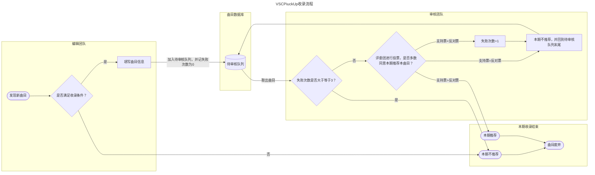

本分则旨在规范每周推歌节目的运行

## 2.1 定义 {#2.1}

### 2.1.1 在本分则中，除非上下文另有要求： {#2.1.1}
 - **收录**指本节目成员将相关曲目收录进入本节目的推荐歌单
 - **待投票**指将曲目加入本节目的待收录列表，但**不一定**收录
 - **虚拟歌手**指代歌声合成技术相关的音色数据库
 - **翻调**指代使用其他虚拟歌手重新制作**非本人原创曲目**的人声部分
 - **翻填**指代对原曲目的歌词进行修改或重新填词，或为原先无人声的曲目添加歌词
 - **废弃**指代将曲目移入废弃队列，废弃队列将永久无法进入待投票队列
  
### 2.1.2 虚拟歌手中文曲定义 {#2.1.2}

  - **虚拟歌手中文曲**（或**中文Vocaloid曲目**， **中V曲目**, **中文虚拟歌手曲目**）指代**所有**使用歌声合成技术，以**中文或者中国境内的方言**主导，且虚拟歌手为主要演唱者的曲目（包括但不限于使用Vocaloid技术，Synthesizer V技术，UTAU技术）
  - **主要演唱者**要求：
  - - 1. 曲目时长的10%需要有人声演唱
    - 2. 虚拟歌手演唱时长必须占有人声部分的50%及以上
    - 3. 虚拟歌手人声必须作为歌曲的主导部分
  - **中文或者中国境内的方言主导**要求：
  - - 1. 歌词的中文或者中国境内的方言字数，且应当占歌词总字数的50%及以上
 
## 2.2 人员构成 {#2.2}

2.2.1 所有参与本周推歌的工作人员名单，都应在官网公布

### 2.2.2 评审团 *（或评委团）* {#2.2.2}

2.2.2.1 **评审团**成员有权**将歌曲加入待投票队列**，并决定歌曲是否**收录**

2.2.2.2 **评审团**对于一首曲目进行一轮投票，采用少数服从多数制
 - 首轮投票决定是否在本周推荐该曲目，若反对票数大于赞同票数，则该曲目回到待推荐队列，并记作一次投票失败
 - 若反对票数等于支持票数，则该曲目回到待推荐队列，不记录投票失败
 - 若反对票数小于支持票数，则该曲目在本期推荐

2.2.2.3 若**评审团**成员的曲目被**加入待投票队列**，则该成员和任一一位评审团成员需要退出投票

2.2.2.4 对于被废弃的曲目，**评审团**需要给出废弃原因，并永久归档

### 2.2.3 编辑团队 {#2.2.3}

2.2.3.1 **编辑团队**的成员有权**将歌曲加入待投票队列**，且负责歌曲基本信息的初步标注

2.2.3.2 **编辑团队**的成员负责用户**自我推荐**歌曲的初步审核

### 2.2.4 视频团队 {#2.2.4}

2.2.4.1 **视频团队**的成员负责视频相关的美术及视频剪辑

## 2.3 板块设计 {#2.3}

2.3.1 本节目分为四大板块，按照曲风分类，分别为流行板块，电子板块，摇滚板块，其他板块（板块排名不分先后）

2.3.2 曲目的板块分类归属**由评审团决定**

2.3.3 原则上每个板块最高收录5首曲目，若本周收录歌曲不足5首的，无需补全

2.3.4 每周六的0点停止新曲目的收录投票，剩余未审核的待投票曲目将进入下一周的待投票队列

2.3.5 在新曲目的收录投票截止前6小时（每周五18:00），若某板块的收录名额已满，且其他板块有剩余名额的，可以借用其他板块的剩余名额推荐超过限额的歌曲

2.3.6 所有收录歌曲的展示时长应控制在20-30秒内

2.3.7 每首收录歌曲应当展示如下信息：
 - 视频BV号及AV号
 - 歌曲的制作人员明细
 - 歌曲使用的虚拟歌手基本信息，包括引擎和其名称
 - 歌曲的详细子曲风
 - 推荐理由
 - 收录方式（自行推荐/编辑推荐）
 - 如果是评审团成员入围，则需要告知观众作者为评委团成员

2.3.8 各板块曲目排名不分先后

## 2.4 收录 {#2.4}

### 2.4.1 重大失格行为 {#2.4.1}
 
2.4.1.1 重大失格行为包含：
 - a) 在**编曲**流程中，使用**生成式AI程序进行编曲的**（包括但不限于：[Suno AI](https://suno.com/about)等）
 - b) 曲目中**任一**图片使用**生成式AI程序进行生图的**（包括但不限于：[novel AI](https://novelai.net/), [Stable Diffusion](https://stabledifffusion.com/zh)，[豆包AI](https://www.doubao.com/)），且**未著明使用AI生成图片**的
 - c) 曲目歌词**使用生成式AI进行作词**的（包括但不限于：[ChatGPT](https://chat.openai.com/), [百度文心一言](https://ai.baidu.com/product/text2image), [Deepseek](https://deepseek.com)）
 - d) 曲目涉及抄袭的他人作品的（无论他人作品类型）
 - e) 其他我们认为不当的行为

2.4.4.2 本节目拒绝收录所有涉及重大失格行为的曲目，并将涉及重大失格行为的作者加入黑名单

2.4.4.3 黑名单内的作者参与制作的曲目将直接被废弃，无法进入待审核队列

2.4.4.4 若作者被加入黑名单，且对处理结果有异议的，可以向我们发起申诉

### 2.4.2 一般收录规则及流程 {#2.4.2}

2.4.2.1 本节目遵循下列收录规则
 - a) 本节目仅收录发布在[Bilibili](https://bilibili.com)的曲目
 - b) 由于本节目精力有限，暂时不收录翻调及翻填作品
 - c) 收录的曲目必须是中文虚拟歌手曲目
 - d) 已经被往期节目收录的曲目，将不会被以后的节目收录
 - e) 已经废弃的曲目，将不会被以后的节目收录
 - f) 稿件的[Bilibili](https://bilibili.com)发布时间在三个月前的作品无法进入待推荐队列
 - g) 原则上不收录时长少于90s的曲目，但是如果接近90s且曲目结构完整且足够优秀，可以收录

### 2.4.3 收录勘误规则 {#2.4.3}

2.4.3.1 对于不符合上述收录规则却被收录并推荐的曲目，节目组应当在所有发布位置显著处发布勘误内容

2.4.3.2 对于违反2.4.1.2和2.4.2.1的曲目，应当移除推荐

2.4.3.3 对于出现**重大失格行为**的曲目，应当在下一期视频公布其涉及的失格行为，并移除推荐

## 2.5 待推荐队列运行机制 {#2.5}

2.5.1 待推荐队列采用“先进先出”原则，进入待推荐队列时间靠前的曲目将最先进入投票

2.5.2 每首曲目进入待推荐队列时，投票失败次数设置为0

2.5.3 若曲目在评审团投票环节投票不通过，则失败次数增加1，并回到待推荐队列末尾

2.5.4 若曲目失败次数达到3次（失败次数==3），则曲目被废弃

## 2.6 自行推荐 {#2.6}

由于编辑无法收集所有曲目，本节目允许用户自我推荐

2.6.1 自行推荐曲目必须由此曲目的创作团队中的任一人推荐

2.6.2 自行推荐曲目必须符合收录范围规则

2.6.3 自行推荐时应当包含如下信息：
 - 歌曲基本信息（BV号）
 - 歌曲的制作人员明细
 - 歌曲使用的虚拟歌手基本信息，包括引擎和其名称
 - 歌曲的曲风，若允许，需要详细到子曲风

2.6.4 自行推荐的曲目将交由编辑团队进行初审，由编辑团队任一成员决定是否进入待审核队列

2.6.5 可以通过官网提供自行推荐渠道，或联系编辑团队的任一成员进行自我推荐

## 2.7 运行流程 {#2.7}

2.7.1 本节目遵循以下流程运行 

2.7.2 **收录歌单**将主要公布在[Bilibili](https://bilibili.com)，并适当的在其他平台进行推广

 
